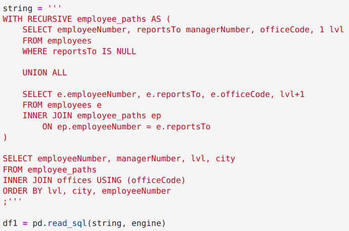
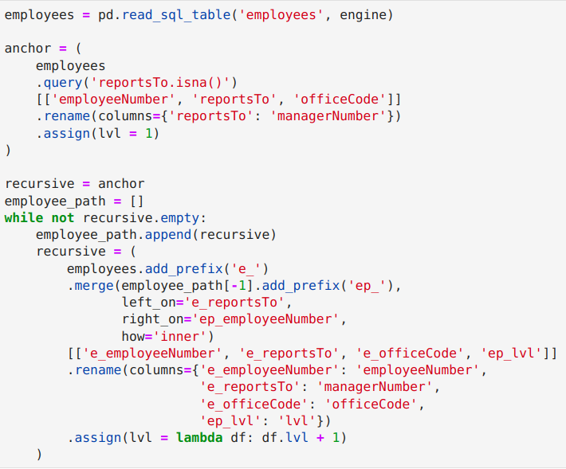
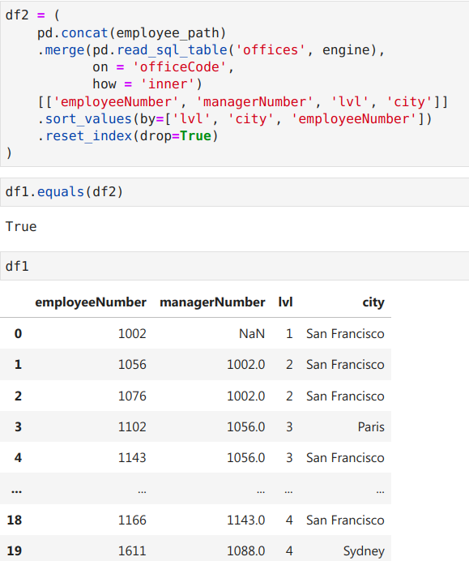

# MySQL - SQLAlchemy - Pandas
These notebooks contain MySQL and Pandas code equivalents. Pandas uses the SQLAlchemy module to connect to MySQL databases and perform database operations.

These MySQL codes are mainly taken from [mysqltutorial.org](https://www.mysqltutorial.org/mysql-basics/) with minor modifications for easier comparison with Pandas codes.

I also provided some tips for [configuring MySQL users and passwords](mysql_user_password_tips.md).

Remember to [load the Sample Database into MySQL Server](https://www.mysqltutorial.org/how-to-load-sample-database-into-mysql-database-server.aspx) before running the notebooks.

Happy coding!

## Code example
**MySQL Recursive CTE:** 

**Emulated Pandas code:**

## Recently added 🆕 ✨

## Table of Content
- [ER Diagram and Tables of the Database](EDA_tables.ipynb)
- [Section 01 Querying Data](<Section 01 Querying Data>)
  - [01 MySQL SELECT](<Section 01 Querying Data/01 MySQL SELECT.ipynb>)
  - [02 MySQL SELECT statement without the FROM clause](<Section 01 Querying Data/02 MySQL SELECT statement without the FROM clause.ipynb>)
- [Section 02 Sorting Data](<Section 02 Sorting Data>)
  - [03 MySQL ORDER BY](<Section 02 Sorting Data/03 MySQL ORDER BY.ipynb>)
- [Section 03 Filtering Data](<Section 03 Filtering Data>)
  - [04 MySQL WHERE](<Section 03 Filtering Data/04 MySQL WHERE.ipynb>)
  - [05 MySQL DISTINCT](<Section 03 Filtering Data/05 MySQL DISTINCT.ipynb>)
  - [06 MySQL AND operator](<Section 03 Filtering Data/06 MySQL AND operator.ipynb>)
  - [07 MySQL OR operator](<Section 03 Filtering Data/07 MySQL OR operator.ipynb>)
  - [08 MySQL IN operator](<Section 03 Filtering Data/08 MySQL IN operator.ipynb>)
  - [09 MySQL NOT IN operator](<Section 03 Filtering Data/09 MySQL NOT IN operator.ipynb>)
  - [10 MySQL BETWEEN operator](<Section 03 Filtering Data/10 MySQL BETWEEN operator.ipynb>)
  - [11 MySQL LIKE operator](<Section 03 Filtering Data/11 MySQL LIKE operator.ipynb>)
  - [12 MySQL LIMIT](<Section 03 Filtering Data/12 MySQL LIMIT.ipynb>)
  - [13 MySQL IS NULL](<Section 03 Filtering Data/13 MySQL IS NULL.ipynb>)
- [Section 04 Joining Tables](<Section 04 Joining Tables>)
  - [14 MySQL Alias](<Section 04 Joining Tables/14 MySQL Alias.ipynb>)
  - [15 MySQL Joins](<Section 04 Joining Tables/15 MySQL Joins.ipynb>)
  - [16 MySQL INNER JOIN](<Section 04 Joining Tables/16 MySQL INNER JOIN.ipynb>)
  - [17 MySQL LEFT JOIN](<Section 04 Joining Tables/17 MySQL LEFT JOIN.ipynb>)
  - [18 MySQL RIGHT JOIN](<Section 04 Joining Tables/18 MySQL RIGHT JOIN.ipynb>)
  - [19 MySQL CROSS JOIN](<Section 04 Joining Tables/19 MySQL CROSS JOIN.ipynb>)
  - [20 MySQL Self Join](<Section 04 Joining Tables/20 MySQL Self Join.ipynb>)
- [Section 05 Grouping Data](<Section 05 Grouping Data>)
  - [21 MySQL GROUP BY](<Section 05 Grouping Data/21 MySQL GROUP BY.ipynb>)
  - [22 MySQL HAVING](<Section 05 Grouping Data/22 MySQL HAVING.ipynb>)
  - [23 MySQL ROLLUP](<Section 05 Grouping Data/23 MySQL ROLLUP.ipynb>)
- [Section 06 Subqueries](<Section 06 Subqueries>)
  - [24 MySQL Subquery](<Section 06 Subqueries/24 MySQL Subquery.ipynb>)
  - [25 An Essential Guide to MySQL Derived Tables](<Section 06 Subqueries/25 An Essential Guide to MySQL Derived Tables.ipynb>)
  - [26 MySQL EXISTS](<Section 06 Subqueries/26 MySQL EXISTS.ipynb>)
- [Section 07 Common Table Expressions](<Section 07 Common Table Expressions>)
  - [27 An Introduction to MySQL CTE](<Section 07 Common Table Expressions/27 An Introduction to MySQL CTE.ipynb>)
  - [28 A Definitive Guide To MySQL Recursive CTE](<Section 07 Common Table Expressions/28 A Definitive Guide To MySQL Recursive CTE.ipynb>)
- [Section 08 Set Operators](<Section 08 Set Operators>)
  - [29 MySQL UNION](<Section 08 Set Operators/29 MySQL UNION.ipynb>)
  - [30 Emulate the MINUS operator by JOIN or EXCEPT](<Section 08 Set Operators/30 Emulate the MINUS operator by JOIN or EXCEPT.ipynb>)
  - [31 MySQL INTERSECT](<Section 08 Set Operators/31 MySQL INTERSECT.ipynb>)
- [Section 09 Modifying Data in MySQL](<Section 09 Modifying Data in MySQL>)
  - [32 MySQL INSERT](<Section 09 Modifying Data in MySQL/32 MySQL INSERT.ipynb>)
  - [33 MySQL INSERT Multiple Rows](<Section 09 Modifying Data in MySQL/33 MySQL INSERT Multiple Rows.ipynb>)
  - [34 MySQL INSERT INTO SELECT](<Section 09 Modifying Data in MySQL/34 MySQL INSERT INTO SELECT.ipynb>)
  - [35 MySQL INSERT ON DUPLICATE KEY UPDATE](<Section 09 Modifying Data in MySQL/35 MySQL INSERT ON DUPLICATE KEY UPDATE.ipynb>)
  - [36 MySQL INSERT IGNORE](<Section 09 Modifying Data in MySQL/36 MySQL INSERT IGNORE.ipynb>)
  - [37 MySQL UPDATE](<Section 09 Modifying Data in MySQL/37 MySQL UPDATE.ipynb>)
  - [38 MySQL UPDATE JOIN](<Section 09 Modifying Data in MySQL/38 MySQL UPDATE JOIN.ipynb>)
  - [39 MySQL DELETE](<Section 09 Modifying Data in MySQL/39 MySQL DELETE.ipynb>)
  - [40 MySQL DELETE JOIN](<Section 09 Modifying Data in MySQL/40 MySQL DELETE JOIN.ipynb>)
  - [41 MySQL ON DELETE CASCADE](<Section 09 Modifying Data in MySQL/41 MySQL ON DELETE CASCADE.ipynb>)
  - [42 MySQL REPLACE](<Section 09 Modifying Data in MySQL/42 MySQL REPLACE.ipynb>)
  - [43 MySQL PREPARE](<Section 09 Modifying Data in MySQL/43 MySQL PREPARE.ipynb>)

## Related resources
My Pandas codes are mainly inspired by this awesome Pandas Cookbook: 
  - [Pandas 1.x Cookbook - 2nd Edition](https://www.amazon.com/Pandas-1-x-Cookbook-scientific-exploratory/dp/1839213108), see it's repository [github](https://github.com/PacktPublishing/Pandas-Cookbook-Second-Edition)

## Contributing

If there are any problems or suggestions, feel free to suggest them on the [issues page](https://github.com/NamLQ/MySQL-SQLAlchemy-Pandas/issues).